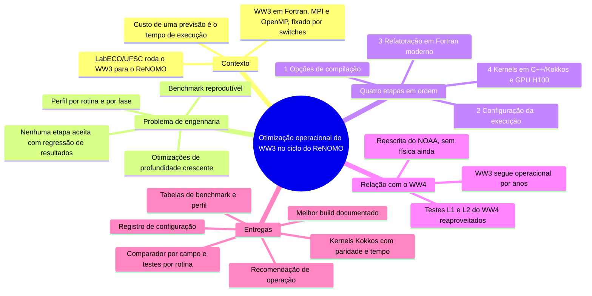
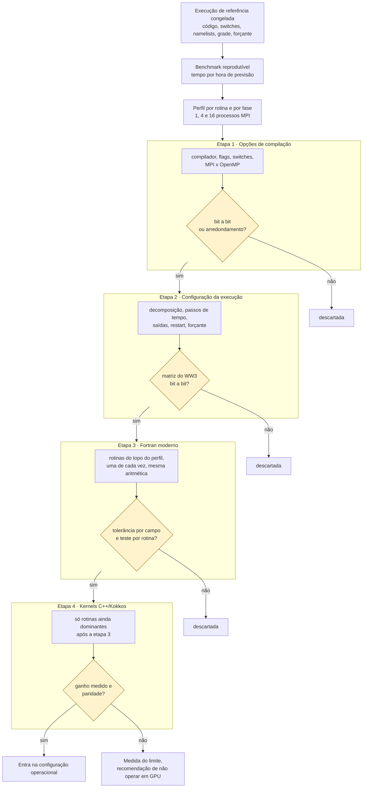
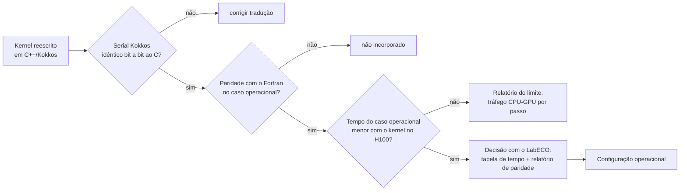
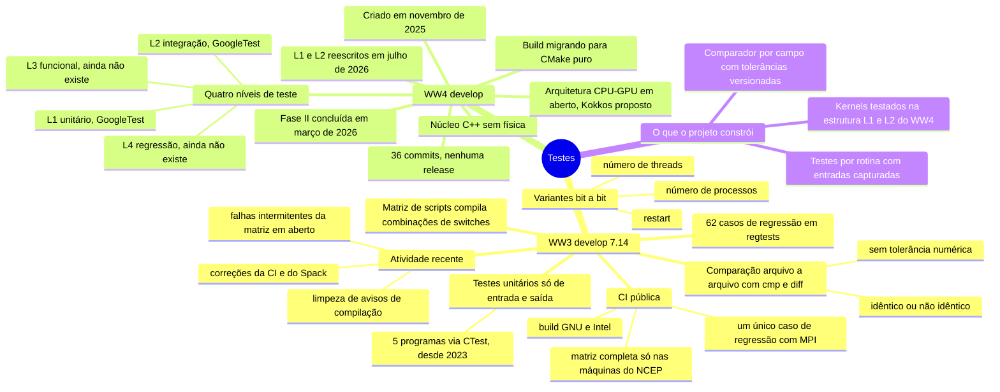
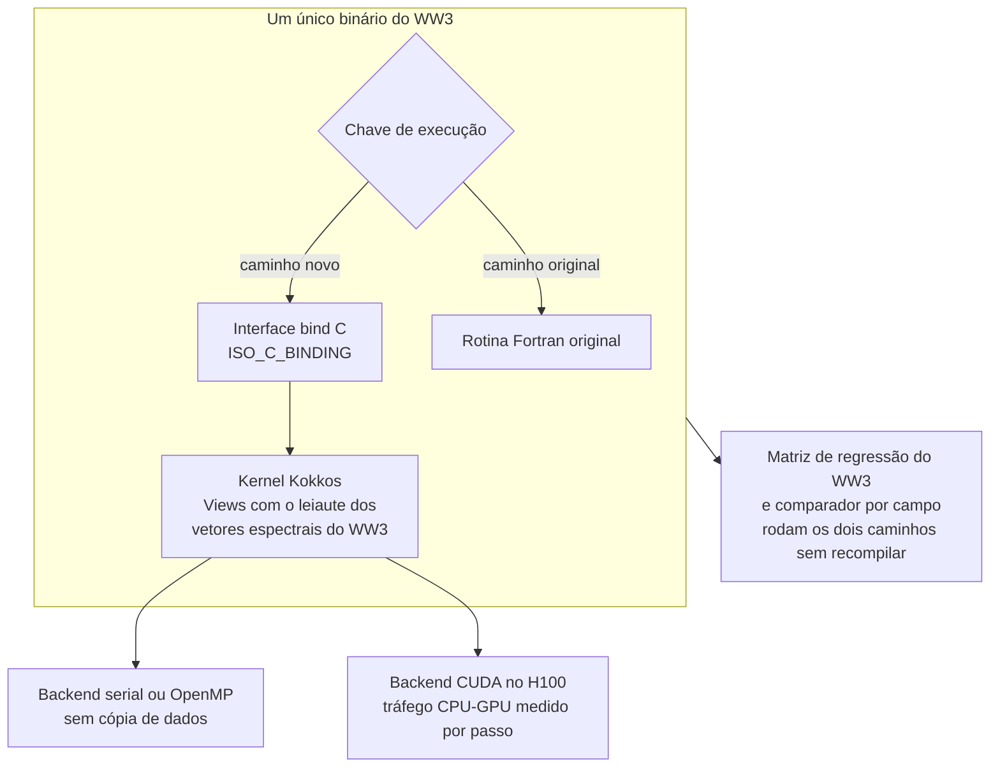
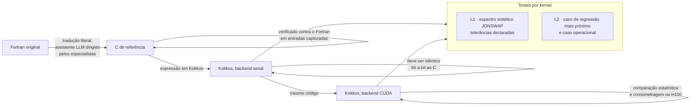
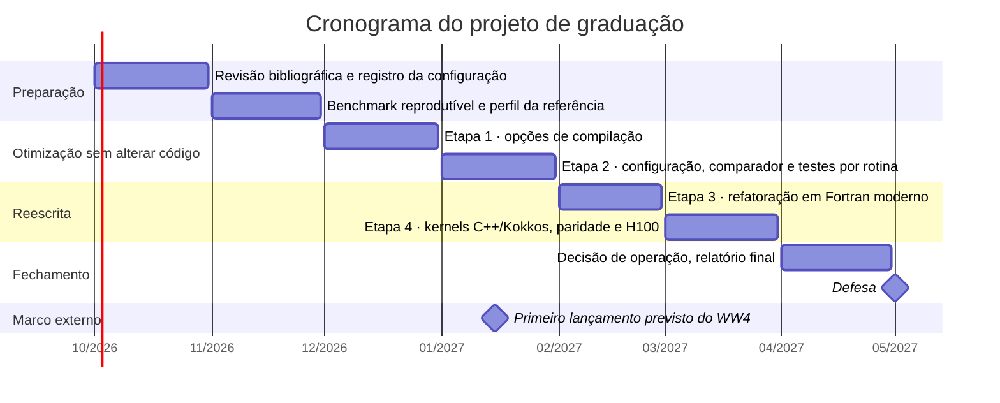
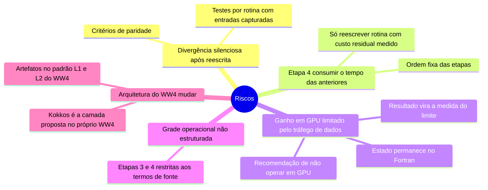

# Mapas mentais da proposta (PT-BR)

Diagramas Mermaid que resumem a Proposta de Projeto de Graduação em `pubs/proposal/pt/`.
O GitHub renderiza os blocos abaixo diretamente; localmente, qualquer visualizador Mermaid serve.

## 1. Visão geral da proposta

## 2. A escada de otimização e os critérios de paridade

## 3. Decisão de operação para um kernel em GPU

## 4. Testes hoje: WW3 e WW4 (levantamento de 15/09/2026)

## 5. Interoperabilidade Fortran e Kokkos

## 6. Validação em escada da tradução (receita do FESOM2)

## 7. Cronograma

## 8. Riscos e mitigações

